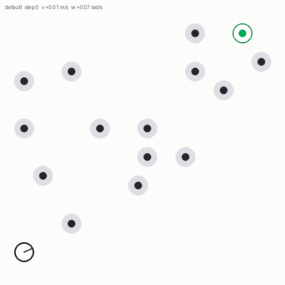

# Robotics: local planning and localization

Two classical mobile-robotics algorithms in C++, each with its derivation, a
test suite, and measurements that back up every tuning choice.

| | What it does | Stack |
|---|---|---|
| [**dwa_local_planner**](dwa_local_planner/) | Dynamic Window Approach local planner | C++17, Eigen, OpenCV, CMake |
| [**mcl_localization**](mcl_localization/) | Monte Carlo Localization (particle filter) | C++17, ROS 2, tf2 |

<p align="center">
  
  
</p>

Both animations are rendered from the programs' own trace output, not from a
separate reimplementation.

## What is here

Each project is split so that the algorithm is independently testable:
`dwa_core` has no OpenCV dependency and `mcl_core` has no ROS dependency, so
every cost term, motion model and sensor model can be unit-tested directly, and
the ROS layer is a thin translation at the boundary.

That split is also what makes the measurements possible. `mcl_localization`
ships an offline evaluation harness instead of a recorded bag: it drives a
simulated robot through the map against known ground truth, so localization
error is a number rather than an impression from watching RViz.

```bash
mcl_evaluate --map map/map.yaml --mode track --seeds 8
#   8/8 seeds converged, mean final error 0.055 m, over a 20.25 m route
#   with odometry drifting 0.31-0.95 m
```

## Some things the measurements settled

**Normalizing DWA's cost terms by their sum leaves the weights meaningless.**
It preserves each term's *relative* spread, so goal distance (mean 32.5 m,
range 0.15 m over the candidate set) is diluted into irrelevance while heading
error (mean 0.39 rad, range 0.56 rad) outweighs it by a factor of ~300 no
matter what the weights say. Min-max normalization gives every term the full
`[0, 1]`, which is also what makes a genuinely bad weighting fail loudly:
scoring on heading alone drives the robot backwards away from the goal, and
weights `1, 2, 1, 0.5` stall it at `v = 0`. [Details.](dwa_local_planner/docs/cost_function.md)

**The textbook product over laser beams is worse than a geometric mean.** With
30 beams the log-likelihood gap between a good particle and a mediocre one runs
to about 120, so one particle takes all the weight and the first resample
annihilates the cloud. Dividing by the beam count gives 8/8 seeds converging at
5 000 particles where the raw product gives 5/8, and makes `beam_skip` a pure
compute knob rather than something that silently retunes the filter's
confidence. [Details.](mcl_localization/docs/algorithm.md)

**A likelihood field in cells² is not a likelihood field in metres².** Feeding
squared cell distance into a Gaussian evaluates `exp(−d⁴/2σ²)`, not
`exp(−d²/2σ²)`, which collapses the sensor model to nothing beyond about one
cell and forces the particle count up by an order of magnitude.

**Map symmetry decides whether global localization is possible at all.** The
shipped map is generated asymmetric on purpose — three differently proportioned
rooms, an alcove, two off-centre pillars — because a symmetric floorplan leaves
mirrored poses that explain a scan equally well.

## Reading guide

| Document | Contents |
|---|---|
| [dwa_local_planner/README.md](dwa_local_planner/README.md) | build, run, parameters, scenarios |
| [dwa_local_planner/docs/cost_function.md](dwa_local_planner/docs/cost_function.md) | cost-term derivation, normalization, weight sensitivity |
| [mcl_localization/README.md](mcl_localization/README.md) | build, run, topics, parameters |
| [mcl_localization/docs/algorithm.md](mcl_localization/docs/algorithm.md) | motion and sensor models, beam combination, measured limits |

Both write-ups state what does *not* work: the planner has no global planner
and will sit in a concave dead end, and the particle filter needs ~5 000
particles for global localization because KLD-adaptive sampling and random
particle injection are not implemented.

## Quick start

```bash
# DWA planner -- no ROS needed
cmake -S dwa_local_planner -B build/dwa -DCMAKE_BUILD_TYPE=Release
cmake --build build/dwa -j
./build/dwa/dwa_local_planner --help
cd build/dwa && ctest --output-on-failure

# MCL -- needs a ROS 2 workspace
colcon build --packages-select mcl_localization
ros2 launch mcl_localization localization.launch.py
colcon test --packages-select mcl_localization
```

Build `dwa_local_planner` with `-DDWA_WITH_GUI=OFF` to skip the OpenCV
visualization entirely; the planner and its tests then run fully headless.

## Author

**Abhinav Thakare** — `abhinavthakare99@gmail.com`

Licensed under [BSD-3-Clause](LICENSE).
