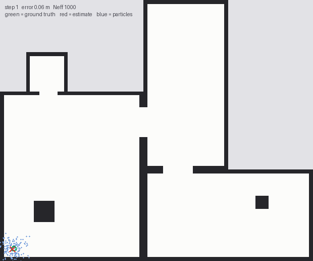

# MCL Localization (ROS 2)

Monte Carlo Localization over a known 2D occupancy grid: an odometry motion
model, a likelihood-field range-finder model, and adaptive low-variance
resampling.



*Green: ground truth. Red: the filter's estimate. Blue: the particle cloud.
Rendered from the evaluation harness output -- see `tools/`.*

References: Thrun, Burgard & Fox, *Probabilistic Robotics* — Table 5.6
(motion), Table 6.3 (likelihood field), Table 4.4 (resampling), ch. 8 (MCL).
The models, the measurements behind the tuning, and the limits are written up
in [docs/algorithm.md](docs/algorithm.md).

## Layout

```
include/mcl/   angles.hpp            wrapping, circular mean
               types.hpp             Pose2D, Particle, LaserScan, PoseEstimate
               occupancy_grid.hpp    origin-aware, bounds-checked conversion
               likelihood_field.hpp  O(n) exact distance transform
               motion_model.hpp      sample_motion_model_odometry
               sensor_model.hpp      likelihood_field_range_finder_model
               particle_filter.hpp   the filter
               mcl_node.hpp          the only header that includes rclcpp
test/          GoogleTest unit tests
```

`mcl_core` has **no ROS dependency**. The node translates messages into plain
structs at the boundary, which is what makes the models unit-testable.

## Build

Needs a ROS 2 distribution (tested against the Humble/Jazzy API).

```bash
# from the workspace root, with this package under src/
rosdep install --from-paths src --ignore-src -r -y
colcon build --packages-select mcl_localization
source install/setup.bash
```

## Run

```bash
ros2 launch mcl_localization localization.launch.py
```

Then set an initial pose with **2D Pose Estimate** in RViz. The launch file
starts `nav2_map_server` (with a lifecycle manager, which it needs to reach
`active`), the `base_link`→`base_laser` static transform, the filter, and
RViz.

| Launch argument | Default | Meaning |
|---|---|---|
| `map` | `map/map.yaml` | map to serve |
| `params_file` | `config/mcl.yaml` | parameter file |
| `use_sim_time` | `false` | set `true` when replaying a bag with `--clock` |
| `rviz` | `true` | start RViz |
| `initialize_globally` | `false` | start from a uniform cloud instead of waiting for `/initialpose` |

### Interface

| | Topic | Type |
|---|---|---|
| sub | `map` | `nav_msgs/OccupancyGrid` (transient-local) |
| sub | `scan` | `sensor_msgs/LaserScan` |
| sub | `odom` | `nav_msgs/Odometry` |
| sub | `initialpose` | `geometry_msgs/PoseWithCovarianceStamped` |
| pub | `particlecloud` | `geometry_msgs/PoseArray` |
| pub | `mcl_pose` | `geometry_msgs/PoseWithCovarianceStamped` |
| TF | `map` → `odom` | |

The node publishes `map`→`odom`, per ROS convention; the odometry source owns
`odom`→`base_link`. The laser offset is read from the `base_frame`→scan-frame
transform, so it only has to be correct in one place.

### Evaluating it offline

The package ships an offline harness instead of a recorded bag: it drives a
simulated robot through the map, corrupts the odometry with drift, ray-casts
scans against the map, runs the filter, and reports the error against known
ground truth. Reproducible from a seed, measurable, and no binary blob in the
repository.

```bash
# built alongside the node
./build/mcl_localization/mcl_evaluate --map map/map.yaml --mode track --seeds 8
./build/mcl_localization/mcl_evaluate --map map/map.yaml --mode global --particles 5000

# animate a run
./build/mcl_localization/mcl_evaluate --map map/map.yaml --trace run.csv
python tools/render_gif.py run.csv --map map/map.pgm -o data/mcl_tracking.gif
```

Exit code is 0 when every seed converged, 1 otherwise, so it works as a CI gate.

### The map

`map/map.pgm` is generated, not recorded:

```bash
python tools/make_map.py --show
```

The layout is deliberately asymmetric -- three rooms of different proportions,
an alcove, two off-centre pillars. A symmetric floorplan leaves mirrored poses
that explain a scan equally well, and global localization can lock onto the
wrong one and never recover. The generator refuses to emit a map whose free
space is not a single connected component.

## Parameters

All of them live in [`config/mcl.yaml`](config/mcl.yaml) and are declared ROS
parameters. Highlights:

| Parameter | Default | Notes |
|---|---|---|
| `particle_count` | 1000 | 200 suffices for tracking; global wants ~5000 |
| `beam_skip` | 12 | use every Nth beam; a pure compute knob |
| `sigma_hit` | 0.1 m | measured optimum; 0.35 and 0.5 were 3–4× worse |
| `z_hit` / `z_rand` | 0.9 / 0.1 | `z_rand` must be non-zero — it is the uniform floor |
| `alpha1`…`alpha4` | 0.05 | motion-model noise |
| `resample_threshold_ratio` | 0.5 | resample when `N_eff < ratio × N` |
| `normalize_by_beam_count` | `true` | geometric mean, not raw product |
| `random_seed` | 42 | runs are reproducible on purpose |

## Tests

```bash
colcon test --packages-select mcl_localization
colcon test-result --verbose
```

~90 cases over angle wrapping and the circular mean, the rigid-transform
sensor offset, grid conversion (map origin, flooring, bounds, rotated origin),
the distance transform against brute force, motion-model σ non-negativity and
angle wrapping, the sensor model across scan lengths and beam counts, the
resampler's index bounds under degenerate weights, and end-to-end tracking
through drifting odometry.

## Performance

Shipped map, 20.25 m route, 30 of 360 beams, odometry drifting 0.35-0.71 m.
8 seeds per row; every number reproducible with `mcl_evaluate`.

| | 200 | 500 | 1 000 | 2 000 | 5 000 particles |
|---|---|---|---|---|---|
| **tracking** (seeded prior) | 8/8, 0.063 m | 8/8, 0.062 m | 8/8, 0.055 m | - | - |
| **global** (uniform cloud) | - | 1/8 | - | 4/8 | **8/8, 0.121 m** |

Tracking is reliable from 200 particles. Global localization needs about 5 000
to be dependable; see [docs/algorithm.md](docs/algorithm.md#5-measured-performance).

## Known limitations

- **Global localization needs ~5 000 particles**, against ~200 for tracking,
  and is unreliable below 2 000. KLD-adaptive sampling would close that gap
  automatically but is **not implemented**, nor is random particle injection
  (AMCL's `recovery_alpha_slow/fast`), so the filter cannot recover if it does
  lock onto a wrong mode. See
  [docs/algorithm.md](docs/algorithm.md#what-is-not-implemented).
- **The reported pose is the mean over all particles**, not the dominant
  cluster's, so it is meaningless while the cloud is multi-modal. The
  published covariance is what makes that detectable — check it rather than
  trusting the mean.
- **No scan-matching or motion-model adaptation**, so very fast rotation or
  wheel slip beyond the `alpha` noise model will lose the lock.
- **Measurement updates run on the latest scan at a fixed rate**, without
  interpolating odometry to the scan timestamp. Fine at walking speed; a
  source of bias at speed.
- **Single-threaded**, O(particles × beams) per update.

## Author

**Abhinav Thakare** — `abhinavthakare99@gmail.com`

A correctness audit and rewrite: the algorithmic fixes are recorded in
`docs/algorithm.md` and in the git history, the algorithm layer was separated
from ROS, the package was ported to ROS 2, and the test suite is new.

